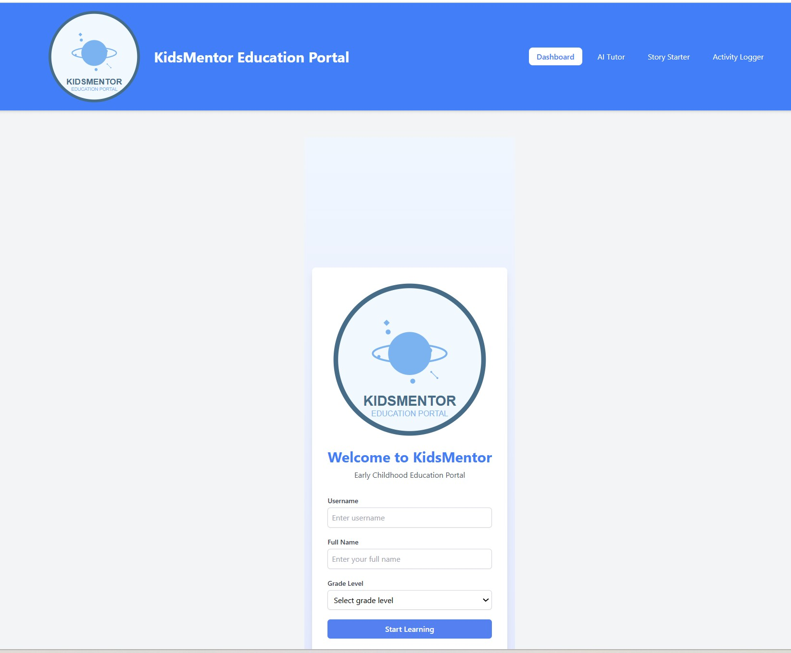
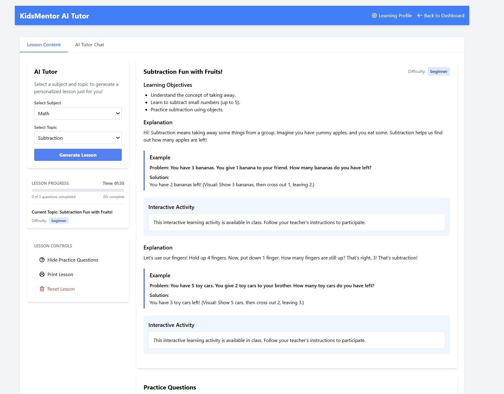
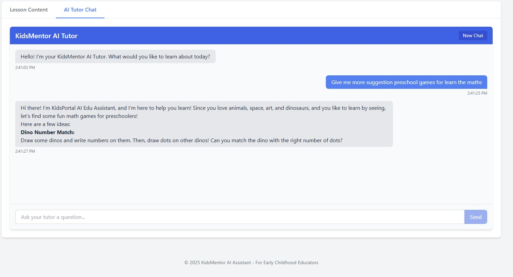
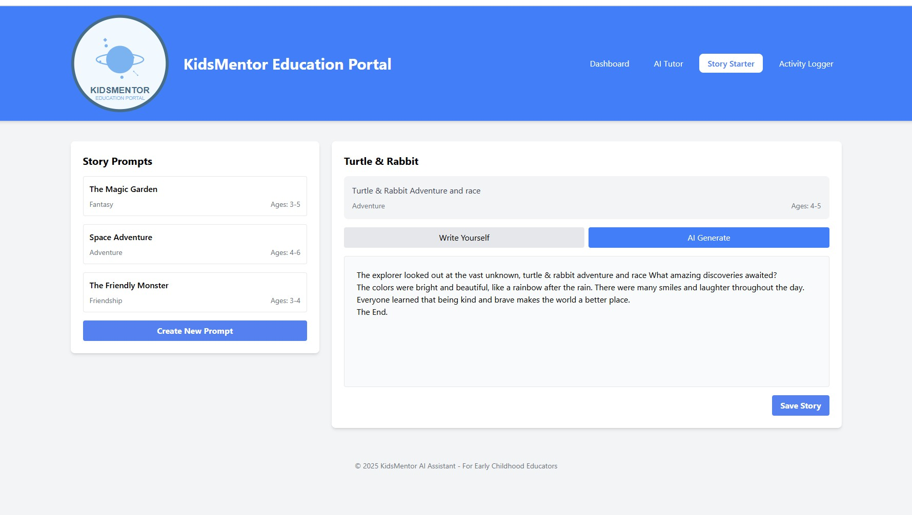
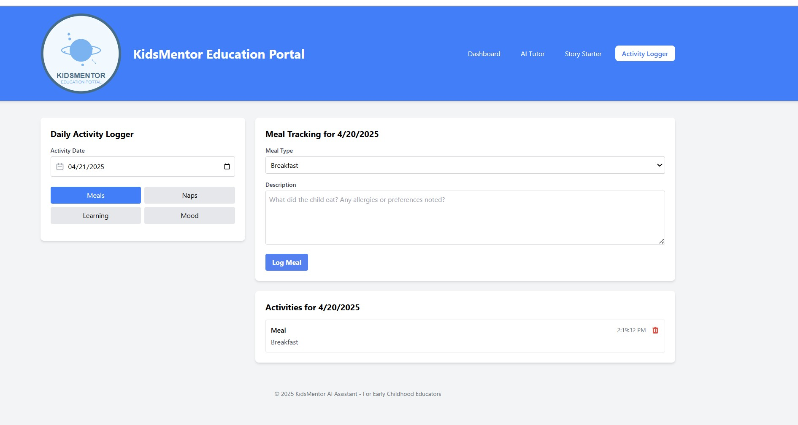

# KidsMentor Education Portal

An interactive education portal for early childhood educators featuring AI-powered tools designed to enhance learning and creativity using Google Gemini Pro 2.0.

## Key Features

### 1. Dashboard

The KidsMentor dashboard provides an intuitive learning hub that features:

- **Personalized Welcome:** Customized experience with student name and progress highlights
- **Visual Progress Tracking:** Engaging charts and achievement badges show learning journey
- **AI-Powered Recommendations:** Smart activity suggestions based on individual learning patterns
- **Quick Access Tools:** Recently used features and "continue where you left off" functionality
- **Intuitive Navigation:** Core features presented prominently with simplified interface
- **Role-Based Views:** Tailored displays for students and educators with relevant controls
- **Responsive Design:** Optimized for all devices from desktop to mobile
- **Real-time Updates:** Progress tracking updates in real-time as students complete activities
- **Customizable Widgets:** Educators can personalize dashboard layout for their teaching style


_The dashboard provides a comprehensive overview of student progress and learning activities._

### 2. AI-Powered Personal Tutor

Provides personalized lesson content across all subjects including Math, Science, Reading, Social Studies, and Art & Music. The tutor adapts content based on student performance and learning objectives.


_The AI Tutor interface allows students to ask questions and receive personalized guidance powered by Google Gemini Flash 2.0._

AI-Powered ChatBot! This Functionality is in AI Tutor feature



### 3. Story Starter

The Story Starter tool helps educators generate creative prompts for storytelling activities tailored to different age groups and themes. Generate creative, age-appropriate story starters for children. Educators can select themes, age groups, and categories to get AI-generated prompts for storytelling activities.


### 4. Daily Activity Logger

Record and track classroom activities, milestones, and learning outcomes.


## Architecture

### Backend

- **FastAPI** framework for high-performance API endpoints
- **Google Gemini Flash 2.0** AI model integration
- RESTful API architecture
- PostgreSQL database for data persistence
- Comprehensive error handling and logging

### Frontend

- **React** with TypeScript
- **Redux** for state management
- **React Router** for navigation
- **Tailwind CSS** for styling
- Responsive design for all device sizes

## Getting Started

### Prerequisites

- Node.js (v16+)
- Python (v3.10+)
- A valid Google Gemini API key

### Installation

#### Backend Setup

1. Navigate to the backend directory

   ```
   cd backend
   ```

2. Create a virtual environment

   ```
   python -m venv venv
   ```

3. Activate the virtual environment

   - Windows: `venv\Scripts\activate`
   - Unix/MacOS: `source venv/bin/activate`

4. Install dependencies

   ```
   pip install -r requirements.txt
   ```

5. Create a `.env` file with your Gemini API key

   ```
   GEMINI_API_KEY=your_api_key_here
   GEMINI_MODEL=gemini-pro
   ```

6. Start the backend server
   ```
   uvicorn main:app --reload
   ```

#### Frontend Setup

1. Install dependencies from the project root

   ```
   npm install
   ```

2. Start the development server
   ```
   npm run dev
   ```

## Using the Application

### Login

1. Enter your username, full name, and grade level
2. Click "Start Learning" to access the dashboard

### Interactive Story Starter

1. Navigate to the Story Starter section
2. Select a theme category and age group
3. Click "Generate" to create AI-powered story starters
4. Use these starters for classroom storytelling activities

### AI-Powered Personal Tutor

1. Navigate to the AI Tutor section
2. Type your question in the chat interface
3. Receive personalized guidance from our AI tutor powered by Google Gemini Pro 2.0
4. Previous conversations are saved for reference

### Activity Logger

1. Go to the Activity Logger section
2. Record daily classroom activities
3. Track student participation and progress
4. Generate activity reports

## Project Structure

```
education-portal/
├── app/
│   ├── components/         # React components
│   ├── pages/              # Page components
│   ├── store/              # Redux store setup
│   │   └── slices/         # Redux slices for state management
│   ├── types/              # TypeScript type definitions
│   └── utils/              # Utility functions
├── public/
│   └── assets/
│       └── images/         # Image assets
├── backend/
│   ├── api/                # API endpoints
│   ├── models/             # Database models
│   └── services/           # Business logic
└── ...
```

### Gemini 2.0 Flash Integration

- The backend now uses Gemini 2.0 Flash for improved AI response performance and quality
- Updated environment configuration to support model customization
- Added support for local environment overrides with `.env.local`

### Learning Profile Enhancements

- Added an "Apply Changes" button to the Learning Profile settings
- Implemented a temporary profile state to prevent changes until explicitly applied
- Added visual feedback when profile changes are successfully applied
- Added persistence for user profiles via localStorage

## License

This project is licensed under the MIT License
